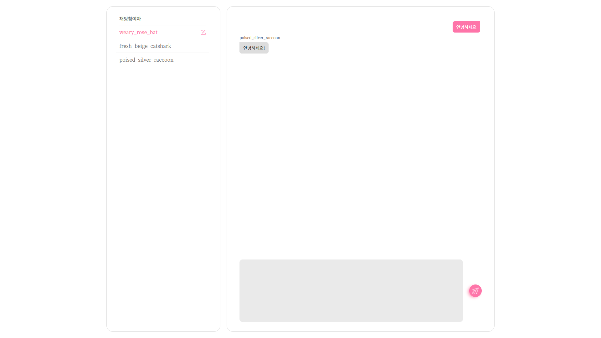

# SimpleChatting(With Javascript)

## how  to Run?

```bash
#server start:
cd SimpleChatiing
npm start
```

---

## Skills

FE: 
, 
, 

BE: 
, 


---

## Collaborator

design: [최송은](https://github.com/ostrichtofu)

programming: [김기현](https://github.com/kiheyunkim)


------

## feature

1. 채팅자가 접속하면 이름은 랜덤하게 생성됩니다.
    * unique-names-generator 모듈 사용
    * 영문 단어 랜덤 조합이 기본 형태
2. 예외 처리
    * 다른 사용자의 접속, 접속 해제 등에 대해서 실시간으로 반영
3. 닉네임 변경 가능
    - 새로고침 등으로 인한 접속해제 시 설정한 닉네임 초기화
4. 모바일 화면 지원

---

## ScreenShot





---

## DB Scheme

No Database


---

## known issue


---

## License
